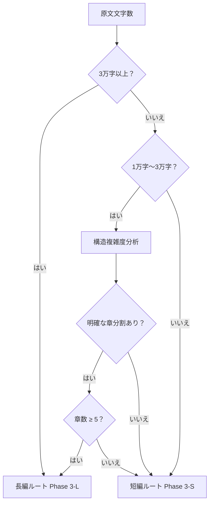

# 長短ルーティング判断ルール

Phase 2 分析完了後、原文の文字数と構造的特徴に基づき長編ルート（Phase 3-L）または短編ルート（Phase 3-S）に振り分ける。

## ルーティング判断基準



## 境界ケースのルール

### 状況一：短編と見なせるか（文字数＜1万かつ章数 1-3）
- 一律短編ルート
- 文字数が極端に少ない場合（＜3000字）はユーザーに確認

### 状況二：中編境界（1万〜3万字、章数 3-5）
- 章タイトルに明らかな長編構造（巻/部/編等）が含まれる → 長編ルート
- 単一章+自然段落区切りのみ → 短編ルート
- デフォルトは長編ルートで、ユーザーが短編を選択可能

### 状況三：多章短編（文字数＜3万だが章数 ≥ 5）
- 各章の文字数分布を確認：
  - 平均文字数＜3000 → 短編ルート（細かく刻まれた短編形式と推定）
  - 平均文字数≥3000 → 長編ルート（長編の初期段階と推定）

### 状況四：長編と見なせるか（文字数≥3万）
- 一律長編ルート
- ただし「章」構造がなく、連続テキストのみの場合はユーザーに確認

## ルーティング結果の通知

```markdown
検出された本文長：{文字数} 字
ルーティング結果：{長編/短編} ルート

理由：{簡潔に説明、例：文字数が 3 万字を超え、明確な章分割（{章数} 章）があるため長編ルートに振り分け}
```

> ユーザーは結果通知後、ルートを手動で上書き可能。

## 品質チェックリスト

- [ ] ルーティング判断ロジックに従い正しいルートを選択
- [ ] ルーティング結果を通知し、手動上書きを許可
- [ ] ルーティング後に該当 Phase 3 の構造移行ルールを適用
